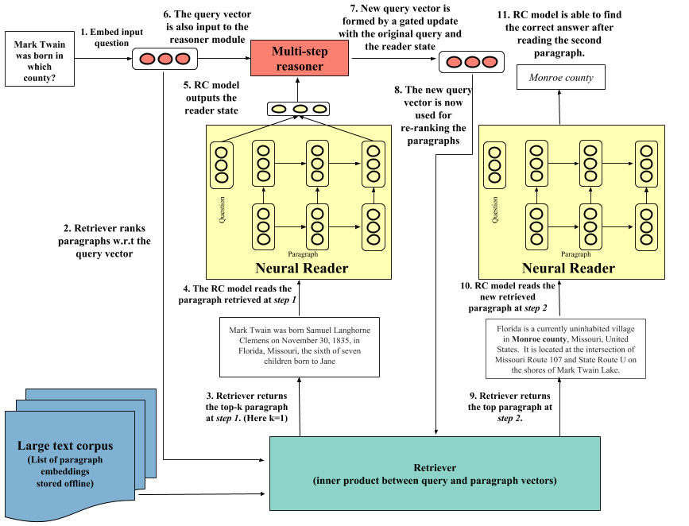

# Multi Step Reasoning for Open Domain Question Answering



Code for the paper [Multi-step Retriever-Reader Interaction for Scalable Open-domain Question Answering](https://openreview.net/forum?id=HkfPSh05K7)

*Acknowledgement*: This codebase started from the awesome [Dr.QA repository](https://github.com/facebookresearch/DrQA) created and maintained by [Adam Fisch](https://people.csail.mit.edu/fisch/). Thanks Adam!

## Setup
The requirements are in the [requirements file](requirements.txt). In my env, I also needed to set PYTHONPATH (as in the [setup.sh](setup.sh))
```
pip install -r requirements.txt
source setup.sh
```

## Data
We are making the pre-processed data and paragraph vectors available so that is is easier to get started. They can downloaded from [here](http://iesl.cs.umass.edu/downloads/multi-step-reasoning-iclr19/data.tar.gz). (41GB compressed, 56GB decompressed). If you need the pretrained paragraph encoder used to generate the vectors, feel free to get in touch with me.
After un-taring, you will find a directory corresponding to each dataset. Each directory further contains:
```
data/ -- Processed data (*.pkl files)
paragraph_vectors/ -- Saved paragraph vectors of context for each dataset used for nearest-neighbor search
vocab/ -- int2str mapping
embeddings/ -- Saved lookup table for faster initialization. The embeddings are essentially saved fast-text embeddings.
```

## Paragraph encoder
If you want to train new paragraph embeddings instead of using the ones we used, please refer to this [readme](paragraph_encoder/README.md)


## Training
```
python scripts/reader/train.py --data_dir <path-to-downloaded-data> --model_dir <path-to-downloaded-model> --dataset_name searchqa|triviaqa\quasart --saved_para_vectors_dir <path-to-downloaded-data>/dataset_name/paragraph_vectors/web-open 
```
Some important command line args
```
dataset_name -- searchqa|triviaqa|quasart
data_dir -- path to dataset that you downloaded
model_dir -- path where model would be checkpointed
saved_para_vectors_dir -- path to cached paragraph and query representations in disk. It should be in the data you have downloaded
multi_step_reasoning_steps -- Number of steps of interaction between retriever and reader
num_positive_paras -- (Relevant during training) -- Number of "positive" (wrt distant supervision) paragraphs fed to train to the reader model. 
num_paras_test -- (Relevant during inference time) -- Number of paragraphs to be sent to the reader by the retriever.
freeze_reader -- when set to 1, the reader parameters are fixed and only the parameters of the GRU (multi-step-reasoner) is trained.
fine_tune_RL -- fune tune the GRU (multi-step-reasoner) with reward (F1) from the fixed reader
```
Training details:
1. During training, we first train the reader model by setting ```multi_step_reasoning_steps = 1```
2. After the reader has been trained, we fix the reader and just pretrain the ```multi-step-reasoner``` (```freeze_reader 1```)
3. Next, we fine tune the reasoner with reinforcement learning (```freeze_reader = 1, fine_tune_RL = 1```)

In our experiments for searchqa and quasart, we found step 2 (pretraining the GRU was not important) and the reasoner was directly able to learn via RL. However, pretraining never hurt the performance as well.

## Pretrained models

We are also providing pretrained models for download and scripts to run them directly. Download the pretrained models from [here](http://iesl.cs.umass.edu/downloads/multi-step-reasoning-iclr19/models.tar.gz).
```
Usage: /bin/bash run_pretrained_models.sh dataset_name data_dir model_dir out_dir
dataset_name -- searchqa|triviaqa|quasart
data_dir -- path to dataset that you downloaded
model_dir -- path to pretrained model that you downloaded
out_dir -- directory for logging
```
## To-do
- [ ] Integrate with code for SGTree
## Citation
```
@inproceedings{
das2018multistep,
title={Multi-step Retriever-Reader Interaction for Scalable Open-domain Question Answering},
author={Rajarshi Das and Shehzaad Dhuliawala and Manzil Zaheer and Andrew McCallum},
booktitle={ICLR},
year={2019},
}
```

